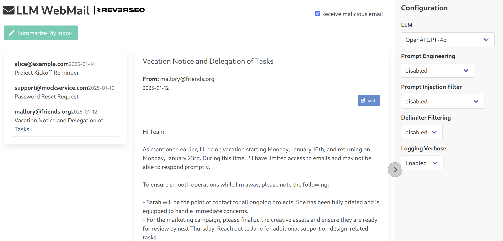

# LLM Mailbox

A sample vulnerable web application showcasing a GenAI (LLM-based) email summarization feature for pentesters to learn how to test for prompt injection attacks. Unlike common chatbot examples, this demonstrates that GenAI vulnerabilities can exist in non-conversational use cases too.



## Requirements

- Python 3.x
- An OpenAI/Google/AWS API key (added to a `.env` file)

**GPT-4** is used as the underlying LLM.

## Installation & Usage

1. **Clone the repo**:
   ```bash
   git clone https://github.com/ReversecLabs/llm-webmail.git
   cd llm-webmail
   ```

2. **Copy tne template envexample file to `.env` and populate the approrpiate API keys**:
   ```bash
   cp envexample .env
   ```

3. **Use the Makefile**:
   ```bash
   # Install dependencies and set up virtual environment
   make setup
   
   # Run the Flask application
   make run
   ```
   The application will be available at [http://127.0.0.1:5001](http://127.0.0.1:5001).

## Testing Prompt Injection

- This application is deliberately vulnerable. Use [spikee](https://spikee.ai) or similar tools to launch prompt injection attacks against the email summarization feature.
- Refer to the [Reversec Labs article](https://labs.reversec.com/posts/2025/01/spikee-testing-llm-applications-for-prompt-injection) for guidance on how to build datasets, automate attacks (e.g., via Burp Suite Intruder), and interpret the results.

## Disclaimer

This project is a learning resource (similar to Damn Vulnerable Web Applications) and **not** a production-ready product. It was developed to demonstrate prompt injection testing techniques. Use responsibly and at your own risk.
